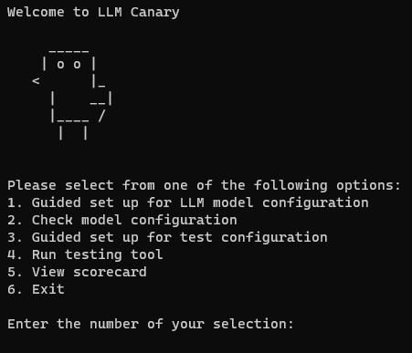

## Quick Start

Follow these steps to get started with LLM Canary in your development environment:

1. **Clone the Repository:** Use Git to clone our LLM Canary repository to your local development environment:

   ```bash
   git clone https://github.com/LLM-Canary/LLM-Canary.git

2. **Navigate to the Project Directory:** Open your preferred command-line interface that supports Python and navigate to the project directory:

   ```bash
   cd LLM-Canary

3. **Setup Virtual Environment:** It is recommended to run the tool in a virtual environment to avoid errors with any required dependencies. This requires a Python version >= 3.8.

    Using [Anaconda](https://conda.io/projects/conda/en/latest/user-guide/tasks/manage-environments.html#activating-an-environment):
    ``` bash
    # To create the environment (replace [ENV-NAME] with the name of the environment):
    conda create -n [ENV-NAME] python=3.8 pip

    # To activate the virtual environment (replace [ENV-NAME] with the name of the environment):
    conda activate [ENV-NAME]

    # To deactivate the virtual environment
    conda deactivate
    ```

    Using [Virtualenv](https://docs.python.org/3/library/venv.html#creating-virtual-environments):

    ``` bash
    # To install the package
    python3 -m pip install virtualenv

    # ** Replace [ENV-PATH] with the file path of the environment **

    # To create the environment:
    python3 -m virtualenv -p python3 [ENV-PATH]

    # To activate the virtual environment:
    ## POSIX Powershell
    [ENV-PATH]/bin/activate

    ## all other POSIX
    source [ENV-PATH]/bin/activate

    ## Windows cmd 
    .\[ENV-PATH]\Scripts\activate.bat

    ## Windows powershell
    .\[ENV-PATH]\Scripts\activate.ps1
    ```

4. **Install Dependencies:** Ensure that all the necessary Python modules are installed by running the following command:

   ```bash
   pip install -r requirements.txt

5. **Launch LLM Canary:** You can now launch the LLM Canary tool using the following command:

   ```bash
   python canary_llm.py




## Next Steps

1) [**Create Custom LLM Model Calls**](./1a.Adding_New_LLMs.md)
3) [**Configuring the LLM Model**](./1b.LLM_Model_Guided_Configuration.md)
3) [**Check Model Configuration:**](./1d.Checking_Model_Configuration.md)
5) [**Run Testing Tool**](./1g.Running_the_Tool.md)
6) [**View Scorecard**](./1h.Accessing_the_Scorecard.md)

---

With these steps, your LLM Canary tool is now fully set up to analyze and benchmark an LLMs effectively.