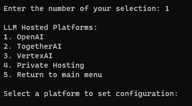

## Configuring the LLM Model

To begin using LLM Canary, the first step is to configure the LLM model. This is essential for tailoring the tool to your specific needs and ensuring accurate benchmarking and analysis.

### Guided Configuration

1. **Access the Configuration Menu:** From the main menu of LLM Canary, select option 1 to enter the LLM configuration sub-menu.

2. **Choose a Cloud Platform:** You will be presented with a list of cloud platforms hosting LLMs. These platforms provide various options to understand and explore the capabilities of LLM Canary.

3. **Enter Platform API Key:** For cloud-hosted LLMs, the menu will guide you through the process of entering your platform API key. Please note, you will need to use your API key as the tool does not provide one.

4. **Configure Additional Variables:** Specify other configuration variables such as the model name and preferred temperature setting for the LLM.

5. **Configuring Custom LLMs:** If you are using a custom LLM hosted within your development environment, follow the prompts to input details like model name, API key, and temperature. You will then need to create a [custom model_call](./1a.Adding_New_LLMs.md) file

6. **Saving Configuration:** The tool will accomodate more than one LLM configuration. All configuration details are saved to a `.env` file in your local environment. This file is automatically deleted when the tool is closed, ensuring your configuration remains secure and private.

## Manual Configuration

If users wish, they can add model parameters to the `.env` file directly. Guidance can be found on the [environment configuration](./1c.LLM_Model_Environment_Configuration.md) page.

### Important Notes

- Ensure that the API key and other sensitive information are kept confidential.
- The tool is designed to be flexible, accommodating various LLMs hosted either on cloud platforms or locally.
- The temperature setting is crucial for controlling the output behavior of the LLM.

By following these steps, you can seamlessly configure LLM Canary for your specific LLM model, whether it's cloud-based or locally hosted. This initial configuration is key to effectively using the tool for benchmarking and exploring LLM capabilities.

---

### Next Steps

- [Checking Model Configuration](./1d.Checking_Model_Configuration.md)
- [Return To The Quick Start Guide](./1.Quick_Start_Guide.md)

