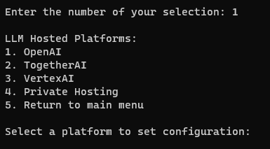

## Checking the model configuration

1. **Checking the model configuration:** From the main menu of LLM Canary, select option 2 to start the verification checks.

The verification checks will run automatically and output one of the following:

1) A confirmation that a model is configured

2) An error message that a model is not configured. It will also display where the error is being detected. To fix the error, the `.env` file can be edited directely by folloing the [environment configuration steps](./1c.LLM_Model_Environment_Configuration.md)

## Important Notes
- This check is verifying that all keys exist; it does not confirm the connection of the API. It is still possible for the API call to fail even if the configuration check passed.
- If the configuration was successful, the .env file will encrypt itself to reduce exposure of the API key. To edit the models configure, complete the [guided model configuration](./1b.LLM_Model_Guided_Configuration.md)

---

### Next Steps

- [Creating Custom Tests](./1e.Creating_Custom_Tests.md)
- [Test Run Configuration](./1f.Test_Run_Configuration.md)
- [Return To The Quick Start Guide](./1.Quick_Start_Guide.md)