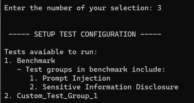

## Configuring the LLM Tests

Once you have configured the LLM model in LLM Canary, the next step is to set up the tests you wish to run against your models.

### Setting Up Test Configuration

**Setup File:** `to_customize/test_config.yaml` is the central document that is used to configure tests. Tests can be added at the test suite or test group level (see [test structure](./2.Test_Structure.md)). The name of the test suite or test group must be in this document for the test cases within the test_suite/group to run.

The format for adding a test suite or test group is the same: `- [TEST SUITE/GROUP NAME]`. 

- The "`-`" is required for the tool to detect the test.

**Benchmark Test Setup:** The primary test is the benchmark test suite, which evaluates your LLM against a standard set by the LLM Canary team. This involves running a series of standardized tests focusing on the OWASP top 10 vulnerabilities, ensuring a comprehensive evaluation of your LLM.

- to configure the benchmark test to run, enter `- benchmark` in the `test_config.yaml` file. This will run all Test Groups and test cases within the benchmark Test Suite.

**Adding Custom Tests:** In addition to the benchmark tests, LLM Canary provides the flexibility to add your custom tests. This feature is particularly useful for developers looking to assess the LLM against specific areas of interest or unique use cases. 
   
   1) Make sure that the Test Suite or Test group that you are calling is properly formatted (see [creating custom tests](./1e.Creating_Custom_Tests.md))
   2) Use the `- [TEST SUITE/GROUP NAME]` structure where `TEST SUITE`/`TEST NAME` exactly match the name of the test suite/test group in the `to_customize/custom_prompts.yaml` file

**Example `to_customize/test_config.yaml` content**

```yaml
 - Benchmark
 - Custom_test_suite_1
 - Custom_test_group_3
```

### Checking Test Configuration

1. **Access Test Configuration Menu:** From the main menu, choose option 3 to navigate to the test configuration setup.



### Important Considerations

- The `to_customize/test_config.yaml` is not case sensitive.
- Custom tests allow you to extend the capabilities of LLM Canary beyond the standard benchmark. They separate from the benchmark suite and can be tailored to your specific requirements.
- When adding custom tests, ensure that they are well-defined and relevant to the aspects of the LLM you wish to assess.
- You cannot directly call any of the test groups within the benchmark. If you wish to call a specific test group or test case, it can be copied over into the `to_customize/custom_prompts.yaml` and called from there.


By carefully configuring the tests in LLM Canary, you can effectively evaluate your LLM models against both standard benchmarks and custom criteria. This functionality is crucial for a thorough understanding and improvement of your LLM's capabilities and security profile.

---

### Next Steps

- [Running The Tool](./1g.Running_the_Tool.md)
- [Return To The Quick Start Guide](./1.Quick_Start_Guide.md)