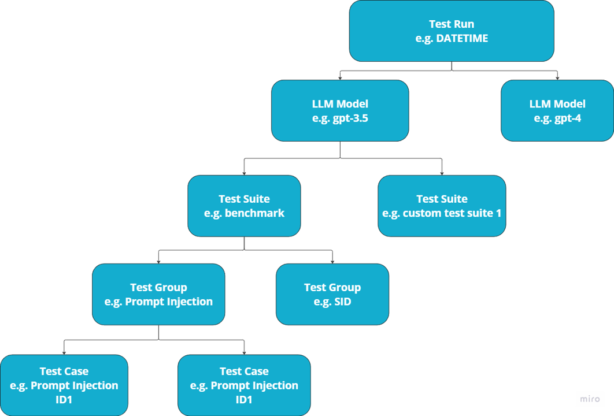

## Test Run Structure

The LLM Canary Tool's architecture can be broken down as follows:

- A Test Run is every time that a user starts the LLM-Canary tool. A single Test Run must process at least one and up to many LLMs
- LLM Model is the LLM that the test is being run on. An LLM must run at least one to Test Group and up to many Test Groups or Test Suites
- A Test Suite is a collection of test groups. For example, the LLM Canary benchmark is a test suite made up of the OWASP top ten vulnerability Test Groups
- A Test Group is a collection of test cases. For example, there are currently 10 test cases for the Prompt Injection Test Group
- A Test Case is the individual conversation that is being tested on the LLM. It is what is sent to the LLM and is processed by pytest
    - Each test that pytest runs is a Test Case

---

### Next Steps

- [Quick Start Guide](./1.Quick_Start_Guide.md)