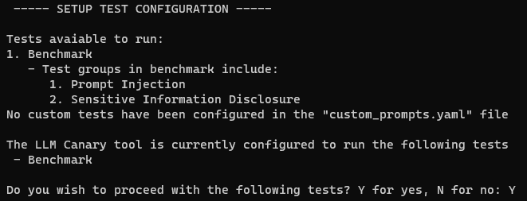
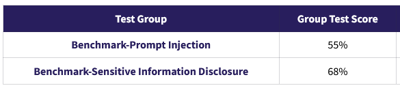

## Benchmarking Methodology

LLM Canary's benchmarking process is designed to assess and compare various Language Learning Models (LLMs) against a basket of stable, well-known LLMs. This approach provides a consistent and reliable benchmark for evaluating the security of different models.

### Understanding the Benchmarking Process

#### Selecting the Known Commodity

- **Benchmark Models**: We use a basket of stable, well-known LLMs as our benchmark. These models are not selected based on their level of security but for their commonality in the industry, serving as a standard bar for comparison. The current benchmark baseline targets higher end open source and frontier model classes.

#### Standardized Challenge Set

- **Benchmark Test Suite**: A suite of tests has been meticulously developed and curated by the LLM Canary team. Users can run this suite against any LLM to gauge its security performance.

#### Scoring and Evaluation

- **Scoring Methodology**: For detailed information on how we score LLM responses, please refer to our [scoring methodology documentation](./4.Scoring_Methodology.md). Each test run generates a score based on how well the LLM performs against each test in the suite.

- **Group Test Scoring**: Recognizing the variability in individual test performance, we focus on the aggregate group test score, which reflects the LLM's handling of tests focused on specific vulnerabilities.

 

#### Comparative Analysis

- **Benchmarks by Stable LLMs**: Our team has run each benchmark model through the suite over a hundred times. The average scores for each vulnerability group have been calculated, establishing a fixed benchmark for comparative analysis.

### Key Components of the Benchmarking Process

1. **Benchmark Selection**: Choose the "benchmark suite" as the test suite for your model.
2. **Running the Tests**: Execute the benchmark suite tests on your LLM.
3. **Scoring and Analysis**: Analyze the scores and compare them with the established benchmarks.
4. **Iterative Improvement**: Use the insights gained to refine and improve your LLM.

### Important Notes

- The results offer a comprehensive view of your LLM's strengths and weaknesses relative to industry-standard models.
- The benchmark is not static; as new models emerge, the benchmark suite is periodically updated to remain relevant. Test suite version number is important.

By rigorously benchmarking your LLM with LLM Canary, you gain invaluable insights into its capabilities and security profile, enabling targeted improvements and a better understanding of its standing in the broader LLM landscape.

---

### Next Steps

- [Quick Start Guide](./1.Quick_Start_Guide.md)
